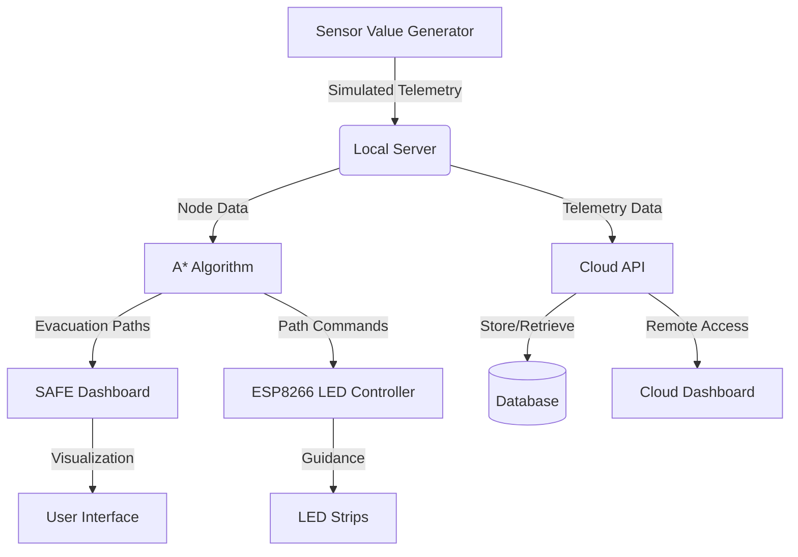

# SAFE: Smart Adaptive Fire Evacuation System

[](LICENSE)


SAFE is a smart fire evacuation system designed for complex buildings. The system simulates fire conditions, detects risk zones, computes safe evacuation paths using the A* algorithm, and guides occupants via LED strips and audio cues. Real-time monitoring is provided through both a local server and a cloud dashboard.

---

## Table of Contents

- [Key Features](#key-features)
- [System Architecture](#system-architecture)
- [Repository Structure](#repository-structure)
- [Getting Started](#getting-started)
  - [Prerequisites](#prerequisites)
  - [Installation and Setup](#installation-and-setup)
- [Modules Overview](#modules-overview)
  - [1. Sensor Value Generator](#1-sensor-value-generator)
  - [2. A* Pathfinding Algorithm](#2-a-pathfinding-algorithm)
  - [3. SAFE Dashboard](#3-safe-dashboard)
  - [4. ESP8266 LED Controller](#4-esp8266-led-controller)
  - [5. Cloud API](#5-cloud-api)
- [API Endpoints](#api-endpoints)
- [Technology Stack](#technology-stack)
- [Contributing](#contributing)
- [License](#license)

---

## Key Features

- **Real-time Fire Simulation:** Simulates sensor data including flame detection, smoke levels, temperature, and people count for realistic testing scenarios.
- **Optimal Path Planning:** Utilizes the A* algorithm to calculate the safest and shortest evacuation routes based on current conditions.
- **Live Dashboard:** Provides an interactive React-based dashboard displaying sensor data, building maps, and calculated evacuation paths.
- **Physical Guidance System:** Controls WS2812B LED strips to visually guide occupants along designated safe paths.
- **Dual-Mode Monitoring:** Supports local server for low-latency control and a cloud API for remote monitoring capabilities.
- **Modular Architecture:** Each component operates independently, allowing for flexible deployment and maintenance.

---

## System Architecture

The SAFE system consists of multiple integrated modules that work together to provide a comprehensive evacuation solution.



---

## Repository Structure

The repository is organized into several independent modules:

```
SAFE/
├── Astar_algorithm/        # A* pathfinding core logic
├── ESP8266/                 # Code for NodeMCU/ESP8266 LED control
├── Layout/                  # SVG layout files for building map
├── SAFE_dashboard/          # React-based frontend dashboard
├── WS2812 LED/              # Legacy LED control code
├── safe-cloud-api/          # Backend API for cloud monitoring
├── sensor_value_generator/  # Frontend for sensor data simulation
├── .gitignore               # Git ignore rules
├── LICENSE                  # MIT License
└── fix-ci                   # CI configuration file
```

---

## Getting Started

### Prerequisites

- Node.js (v16 or higher) and npm for dashboard and cloud API components
- Python 3.x for any backend components (refer to individual module documentation)
- Arduino IDE or PlatformIO for ESP8266 firmware upload
- WS2812B LED strip with compatible power supply for hardware demonstration

### Installation and Setup

1.  **Clone the repository:**
    ```bash
    git clone https://github.com/AdityaWaradkar/SAFE.git
    cd SAFE
    ```

2.  **Module-specific setup:** Navigate into individual module folders and follow their respective documentation. A quick overview is provided below.

---

## Modules Overview

### 1. Sensor Value Generator
- **Location:** `/sensor_value_generator`
- **Purpose:** Simulates sensor data for all nodes including flame detection, smoke levels, temperature, and people count. Provides a user interface for manual control to test system behavior under various conditions.
- **Technology:** React, Vite
- **Setup:**
    ```bash
    cd sensor_value_generator
    npm install
    npm run dev
    ```
- **Configuration:** Uses `.env.local`, `.env.lan`, and `.env.cloud` files to target different backend environments.

### 2. A* Pathfinding Algorithm
- **Location:** `/Astar_algorithm`
- **Purpose:** Core logic that calculates optimal evacuation paths based on node data and building layout. Outputs paths as sequences of nodes for consumption by other system components.
- **Technology:** Python/JavaScript (refer to module documentation for specifics)

### 3. SAFE Dashboard
- **Location:** `/SAFE_dashboard`
- **Purpose:** Primary web interface for safety personnel. Displays real-time sensor data, interactive building maps with highlighted evacuation paths, system logs, and alerts.
- **Technology:** React, Tailwind CSS, Lucide Icons, React-SVG
- **Setup:**
    ```bash
    cd SAFE_dashboard
    npm install
    npm run dev
    ```
- **Features:**
    - Real-time data updates every 2 seconds
    - Interactive SVG map with zoom and pan controls
    - Color-coded sensor cards and path visualization
    - Dark and light mode theme support

### 4. ESP8266 LED Controller
- **Location:** `/ESP8266`
- **Purpose:** Firmware for NodeMCU/ESP8266 microcontroller. Receives path commands and controls WS2812B LED strips to illuminate evacuation routes on the floor.
- **Technology:** C++ (Arduino Framework)
- **Setup:** Open the `.ino` file in Arduino IDE, install required libraries, configure Wi-Fi credentials, and upload to the board.

### 5. Cloud API
- **Location:** `/safe-cloud-api`
- **Purpose:** Backend service that receives and stores telemetry data and path information, enabling remote monitoring through a cloud dashboard.
- **Technology:** Node.js, Express
- **Setup:**
    ```bash
    cd safe-cloud-api
    npm install
    npm start
    ```

---

## API Endpoints

The local server (typically running on port 5000) and cloud API expose the following endpoints for data exchange.

| Method | Endpoint           | Description                                      | Source Module          |
|--------|--------------------|--------------------------------------------------|------------------------|
| GET    | `/data/nodes`      | Retrieves latest simulated sensor data           | Sensor Value Generator |
| POST   | `/data/nodes`      | Publishes new sensor data to local server        | Sensor Value Generator |
| GET    | `/paths`           | Retrieves calculated evacuation paths            | A* Algorithm           |
| GET    | `/api/telemetry`   | Retrieves historical or latest telemetry data    | Cloud API              |
| GET    | `/api/paths`       | Retrieves stored evacuation paths                | Cloud API              |

Refer to the documentation within each module for detailed API specifications.

---

## Technology Stack

- **Frontend Applications (Dashboard and Simulator):**
  - React
  - Vite
  - Tailwind CSS
  - Lucide Icons
  - React-SVG

- **Backend Services (Local Server and Cloud API):**
  - Node.js
  - Express

- **Pathfinding Algorithm:**
  - A* implementation (Python/JavaScript)

- **Hardware Control:**
  - C++ (Arduino Framework)
  - ESP8266 / NodeMCU
  - WS2812B LED Strips

---

## Contributing

Contributions to the SAFE project are welcome. To contribute:

1. Fork the repository
2. Create a feature branch (`git checkout -b feature/YourFeature`)
3. Commit changes (`git commit -m 'Add new feature'`)
4. Push to the branch (`git push origin feature/YourFeature`)
5. Open a pull request

---

## License

Distributed under the MIT License. See the `LICENSE` file for more information.

---

**Project Repository:** [https://github.com/AdityaWaradkar/SAFE](https://github.com/AdityaWaradkar/SAFE)
